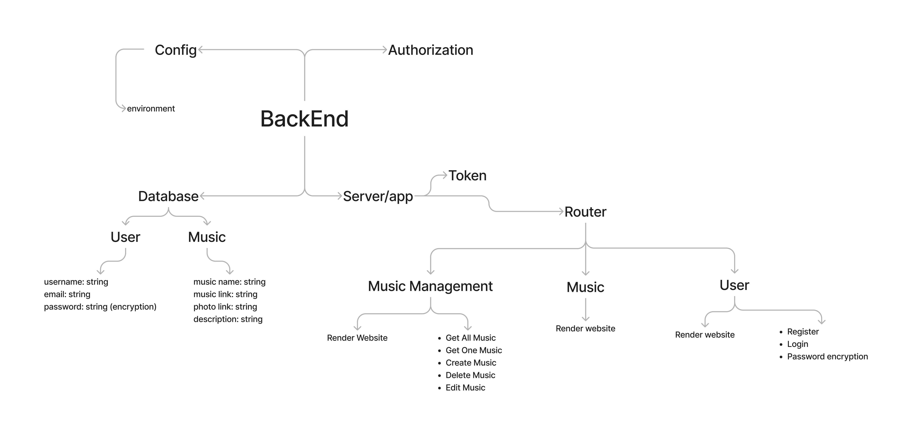
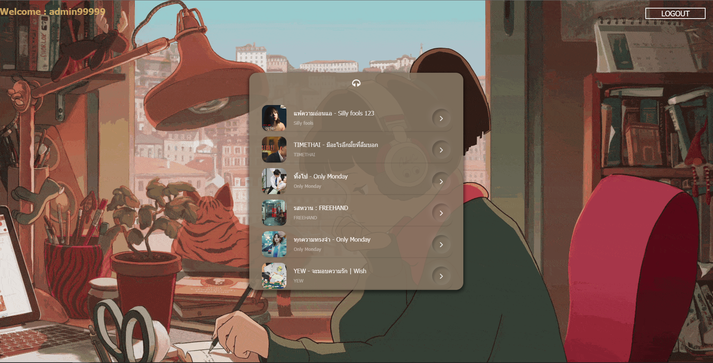
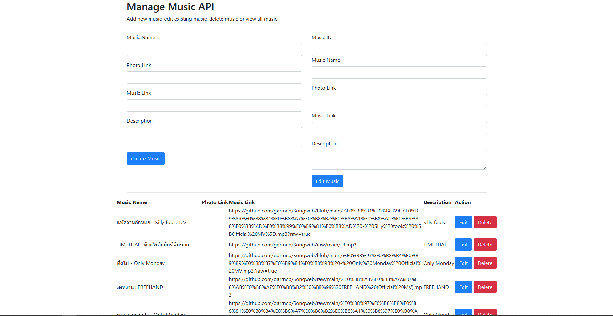

# Project Name : MaliMusic


## Description
This backend project Music listening

## Members
- Nutchaphon Sitthiarasa 6352300090
- Janyapornpom Teeranan 6352300138
- Thawatchai Bauchan 6352300197 
- Nattanan Boonmun 6352300219
- Natthathida Raikhunthod 6352300367
- Sattrawut Peazui 6352300405

## PANYAPIWAT Institute of Management


# Installation
```npm install```

# Usage
```npm run test``` for testing

```npm start``` for production

```npm run dev``` for development

# Library Used 
- Http for create server to listen port
- Express for routing api for backend
- Nodemon for development server 
- Mongoose for manage database 
- Body-parser for parse body request 
- ejs for view engine 
- axios for http request for api call 
- bcryptjs for hash password for security
- jsonwebtoken for generate token for authentication
- mongodb for database connection 
- morgan for log request and response in console
- dotenv for load environment variable
# Structure Design
<!-- show photo -->


## Login Page Image


## Music Page Image


## Music Management Page Image


# Video Presentation
<!-- [](https://youtu.be/1ZQ2QZ1ZQ2Q) -->